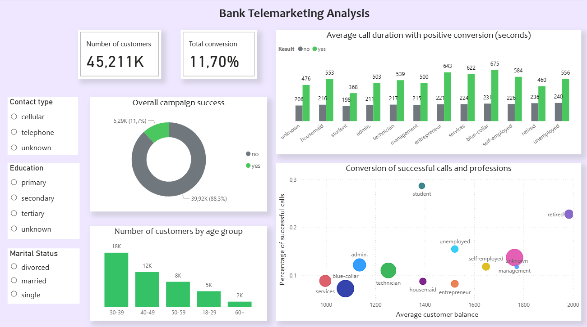

# bank_deposit_analysis
# Bank Telemarketing Analysis

## Project Overview
This project focuses on analyzing data from a Portuguese banking institution's telemarketing campaigns. The primary goal was to identify the key factors influencing the successful subscription of term deposits and to create an Ideal Customer Profile for future campaigns.

## Tech Stack
* Python: End-to-end data processing, cleaning, segmentation (age groups), and statistical analysis.
* Power BI: Creation of an interactive dashboard to visualize key business insights.

## Conclusions
Age Trends: The highest conversion rates are seen in the young adult (18-29) and senior (60+) segments.
Occupation Matters: Students and retirees are the most loyal segments, while "blue-collar" and service industry workers show the lowest success rates.
Education Impact: Customers with tertiary education not only have higher average balances but also show a greater tendency to subscribe to the product.
Call Duration Correlation: There is a direct positive correlation between call duration and success. The average duration of successful calls significantly exceeds that of refusals.
Financial Health: Customers with a higher average balance are more likely to accept the deposit offer, confirming the product's appeal to a more affluent audience.

## Reccomendation
* Strategy for young adult and senior: Focus on relationship-based communication. Since these segments value interaction and have a higher average call duration, agents should prioritize a friendly, detailed approach rather than a quick sales pitch.
* Strategy for blue-collar and admin-workers: Introduce short-term high-yield deposits or value-added card benefits (cashback, lower transaction fees). This addresses their need for immediate financial benefits and flexibility.

## Files
1. Original file `\Excel`.
2. File witj Pythone code `\jupyter`.
3. Interactive dashboard `\Power BI`.

