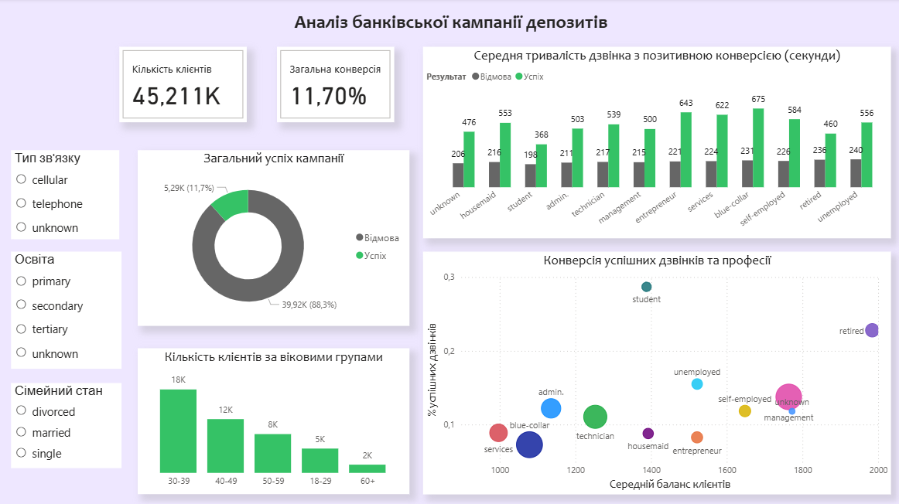

# bank_deposit_analysis
# Аналіз ефективності маркетингової кампанії банку
## Опис
Цей проект присвячений аналізу даних телемаркетингової кампанії португальської банківської установи. Головною метою було виявити фактори що найбільше впливають на успішне оформлення термінового депозиту клієнтом, та створити профіль ідеального клієнта для майбутніх кампаній.
## Технологічний стек
* **Python:** Повна обробка даних, очищення, сегментація (вікові групи) та статистичний аналіз.
* **Power BI:** Створення інтерактивного дашборду для візуалізації ключових інсайтів.
## Висновки
* **Віковий тренд:** Найвищу конверсію демонструють молодь (18-29) та пенсіонери (60+).
* **Професії:** Студенти та пенсіонери є найбільш лояльними сегментами тоді як "blue colar" та працівники сфери послуг мають найнижчий показник успіху.
* **Освіта:** Клієнти з вищою освітою (tertiary) мають не тільки вищий середній баланс а й більшу схильність до оформлення продукту.
* **Тривалість розмови:** Існує пряма кореляція між тривалістю дзвінка та успіхом. Середня тривалість успішної розмови значно перевищує час відмов.
* **Баланс рахунку:** Клієнти з вищим середнім балансом частіше приймають пропозицію депозиту що підтверджує орієнтацію продукту на платоспроможну аудиторію.

## Рекомендації
* Стратегія для молоді та людей похилого віку: зосередитися на комунікації, що базується на відносинах. Оскільки ці сегменти цінують взаємодію та мають вищу середню тривалість дзвінків агенти повинні надавати перевагу дружньому, детальному підходу а не швидкому продажу.
* Стратегія для робітників та адміністративних працівників: запропонуйте короткострокові високодохідні депозити або додаткові переваги карток (кешбек, нижчі комісії за транзакції). Це задовольнить їхню потребу в негайних фінансових вигодах та гнучкості.

## Папки
1. Оригінальний файл ('bank-full') та файл після Python коду ('EDA') знаходиться в папці `\Excel`.
2. Файл з Python `\Jupyter`.
3. Інтерактивний дашборд `\Power BI`.

